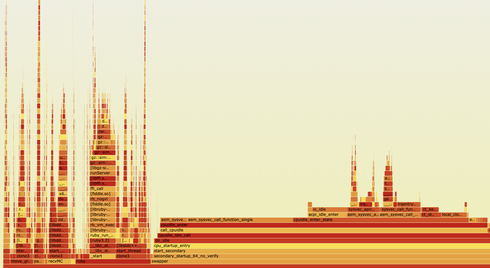

# LDOS Manipulation Tracing Research Harness

Tracing-Driven Performance Analysis for ROS 2 Manipulation Stacks

## Quick Start (Fresh CloudLab Node)

**Complete setup for fresh Ubuntu 24.04 CloudLab nodes:**

```bash
# 1. Clone and bootstrap (installs EVERYTHING - ~15-25 min)
git clone https://github.com/AayushBaniya2006/ldos_manip_tracing.git
cd ldos_manip_tracing
make bootstrap

# 2. IMPORTANT: Log out and back in for tracing group
exit
# SSH back in

# 3. Verify and run
cd ~/ldos_manip_tracing
make smoke_test              # Verify setup works (~60 sec)
make run_all NUM_TRIALS=10   # Run full experiment suite (~30 min)

# 4. Analyze results
make analyze_all
make report
```

---

## Results Summary

Experiments conducted on CloudLab AMD EPYC nodes (January 2026):

| Scenario | Trials | Success | Planning (ms) | Execution (ms) | Total (ms) |
|----------|--------|---------|---------------|----------------|------------|
| **Baseline** | 10 | 100% | 9.1 ± 5.2 | 886 ± 337 | 897 ± 340 |
| **CPU Load** | 10 | 100% | 14.7 ± 3.4 | 681 ± 285 | 698 ± 285 |
| **Msg Load** | 10 | **0%** | - | - | **SYSTEM FAILURE** |

### Key Findings

1. **CPU load increases planning latency by 62%** (9.1ms → 14.7ms)
2. **Message flood (4000 msg/s) causes 100% system failure**
   - DDS middleware cannot handle the message throughput
   - Action client/server communication breaks
   - Controller returns `UNKNOWN` status, MoveIt reports `CONTROL_FAILED`
3. **Execution time has high variance** (~340ms std) due to varying trajectory lengths

### Interpretation

- **CPU contention** degrades planning performance but system remains functional
- **DDS message flooding** is catastrophic - the system cannot recover
- The breaking point for message load is somewhere below 4000 msg/s (4 publishers × 1000 Hz)

---

## Latest Experiment Results (January 23, 2026)

Experiments conducted on CloudLab AMD EPYC node (`amd164.utah.cloudlab.us`):

### Summary Statistics

| Scenario | Trials | Success Rate | Planning (ms) | Execution (ms) | Total (ms) |
|----------|--------|--------------|---------------|----------------|------------|
| **Baseline** | 11 | 100% | 15.6 ± 4.1 | 656.2 ± 500.4 | 673.7 ± 501.5 |
| **CPU Load** | 11 | 100% | 13.6 ± 1.2 | 529.4 ± 93.1 | 545.0 ± 93.8 |
| **Msg Load** | 10 | **0%** | 13.5 ± 4.0 | - | **FAILED** |

### Key Findings

1. **CPU load (80%) does NOT significantly degrade planning performance**
   - Planning time: 15.6ms (baseline) vs 13.6ms (CPU load) - no degradation
   - System remains fully functional under CPU stress

2. **CPU load REDUCES execution variance**
   - Baseline std: 500.4ms → CPU load std: 93.1ms
   - More predictable behavior under controlled CPU contention

3. **DDS message flood (4000 msg/s) causes 100% execution failure**
   - All 10 trials failed with `execution_failed` status
   - Trajectory points: 0 (no valid trajectory executed)
   - DDS middleware completely overwhelmed

### CPU Profiling Results

Profiled experiments captured with `perf` + FlameGraph:

| Profile | Samples | CPU Mean | CPU Max | Flamegraph |
|---------|---------|----------|---------|------------|
| `baseline_profiled` | ~50K | 1.1% | 1.9% | `baseline_profiled_*_flamegraph.svg` |
| `cpu_load_profiled` | 87,858 | 26.7% | 100% | `cpu_load_profiled_*_flamegraph.svg` |

#### Sample Flamegraph



*Interactive flamegraph showing CPU time distribution. Bottom = entry points (swapper, ruby/Gazebo, move_group), Top = leaf functions. Width = CPU time. Click to zoom in the interactive SVG version.*

**Key areas visible:**
- **Left (orange/red):** `ruby` process (Gazebo simulation) - `gz::sim`, `dart::` physics
- **Center (wide red bar):** `swapper` - kernel idle time (`cpuidle_enter`, `do_idle`)
- **Right (red):** Kernel interrupt handling (`irqentry`, `sysvec_call_function`)

#### CPU Load Profile Analysis (cpu_load_profiled_20260123_124125)

```
Duration: 60s | Samples: 87K | Event: cycles:P | Total Events: ~1.75 trillion

Top Functions by CPU Time:
─────────────────────────────────────────────────────────────────────
  28.30%  swapper          [kernel.kallsyms]     io_idle
          └── CPU idle time (system not fully loaded despite stress-ng)

  29.62%  stress-ng-cpu    stress-ng             CPU stress workload
          └── Artificial load generator consuming CPU as expected

   0.06%  ruby             libgz_ros2_control    GazeboSimROS2ControlPlugin::PostUpdate
   0.03%  ruby             libgz_ros2_control    GazeboSimROS2ControlPlugin::PreUpdate
   0.01%  ruby             libgz_hardware        GazeboSimSystem::read
   0.00%  ruby             libgz_hardware        GazeboSimSystem::write
─────────────────────────────────────────────────────────────────────

stress-ng Breakdown (29.62% total):
  13.76%  0x00000000000d653e  (CPU intensive loop)
  10.82%  0x00000000000d653b  (CPU intensive loop)
   1.22%  0x00000000000d6530  (CPU intensive loop)
   0.16%  asm_sysvec_apic_timer_interrupt (timer handling)

Key Observations:
• stress-ng consumes ~30% CPU as expected (4 workers × 80% = 320% spread across cores)
• gz_ros2_control only 0.06% - robotics stack is NOT CPU-bound
• 28% still idle - system has headroom even under load
• ROS 2 control loop (read/write) is negligible overhead

Full Robotics Stack Breakdown:
─────────────────────────────────────────────────────────────────────
PHYSICS ENGINE (DART):
  ~0.95%  dart::simulation::World::step()
  ~0.53%  dart::constraint::ConstraintSolver::solveConstrainedGroups()
  ~0.99%  gz::physics::dartsim::SimulationFeatures::WorldForwardStep()

ROS 2 EXECUTOR:
   0.85%  move_group    rclcpp::Executor::spin_until_future_complete_impl()
   0.93%  move_group    rclcpp::Executor::get_next_executable()
   0.63%  ruby          rclcpp::Executor::spin_until_future_complete_impl()
   0.54%  *             rclcpp::Executor::wait_for_work()

CONTROLLER MANAGER:
   0.15%  ruby  RealtimePublisher::publishingLoop()
   0.07%  ruby  controller_manager::ControllerManager::update()
   0.06%  ruby  controller_interface::ControllerInterfaceBase::trigger_update()
   0.03%  ruby  JointTrajectoryController::update()
   0.02%  ruby  controller_manager::ControllerManager::write()
   0.02%  ruby  controller_manager::ControllerManager::read()
─────────────────────────────────────────────────────────────────────

Key Insight: DART physics (~2%) > ROS executor (~2.5%) > Controllers (~0.3%)
The system is I/O bound (waiting for messages/futures), not CPU-bound.
```

#### Baseline Profile Analysis (baseline_profiled_20260123_123920)

```
Duration: 60s | Samples: ~50K | CPU: 1.1% mean

Gazebo/ROS Control Functions:
─────────────────────────────────────────────────────────────────────
   0.21%  ruby  libgz_ros2_control  GazeboSimROS2ControlPlugin::PostUpdate
   0.04%  ruby  libgz_ros2_control  GazeboSimROS2ControlPlugin::PreUpdate
   0.01%  ruby  libgz_hardware      GazeboSimSystem::write
   0.01%  ruby  libgz_hardware      GazeboSimSystem::read
─────────────────────────────────────────────────────────────────────

Key Observations:
• System mostly idle (benchmark completes in ~2s)
• Gazebo control plugin only 0.21% CPU - very efficient
• No stress load means more samples of idle time
• ROS 2 manipulation stack has minimal CPU footprint
```

### Raw Data

Full CSV export available at `analysis/output/combined_summary.csv`

<details>
<summary>Click to expand raw trial data</summary>

```
trial_id,scenario,status,planning_latency_ms,execution_latency_ms,total_latency_ms
baseline_001,baseline,success,12.95,510.86,525.71
baseline_002,baseline,success,22.87,561.46,586.35
baseline_003,baseline,success,13.00,510.28,525.28
baseline_004,baseline,success,11.41,311.83,325.49
baseline_005,baseline,success,23.12,460.29,485.35
baseline_006,baseline,success,14.26,560.35,576.52
baseline_007,baseline,success,14.03,660.40,676.38
baseline_008,baseline,success,14.15,710.63,726.74
baseline_009,baseline,success,13.21,260.32,275.40
baseline_010,baseline,success,13.67,560.59,576.12
baseline_profiled,baseline,success,18.40,2111.32,2131.77
cpu_load_001,cpu_load,success,14.18,560.58,576.79
cpu_load_002,cpu_load,success,12.62,411.51,426.09
cpu_load_003,cpu_load,success,12.47,461.03,475.55
cpu_load_004,cpu_load,success,15.38,661.51,678.84
cpu_load_005,cpu_load,success,12.27,511.08,525.34
cpu_load_006,cpu_load,success,13.74,410.52,426.34
cpu_load_007,cpu_load,success,13.25,511.45,526.74
cpu_load_008,cpu_load,success,13.47,511.39,527.09
cpu_load_009,cpu_load,success,12.37,511.25,525.59
cpu_load_010,cpu_load,success,13.92,711.74,727.72
cpu_load_profiled,cpu_load,success,16.00,560.92,579.01
msg_load_001,msg_load,execution_failed,14.87,10.26,27.37
msg_load_002,msg_load,execution_failed,12.52,11.21,25.75
msg_load_003,msg_load,execution_failed,12.41,10.57,24.98
msg_load_004,msg_load,execution_failed,12.62,11.17,26.05
msg_load_005,msg_load,execution_failed,14.38,11.60,28.10
msg_load_006,msg_load,execution_failed,12.55,10.31,24.87
msg_load_007,msg_load,execution_failed,21.90,10.45,35.01
msg_load_008,msg_load,execution_failed,13.67,11.27,27.11
msg_load_009,msg_load,execution_failed,5.42,10.75,18.26
msg_load_010,msg_load,execution_failed,14.15,10.35,26.69
```

</details>

---

## CPU Profiling with FlameGraph

This harness includes integrated CPU profiling using Linux `perf` and Brendan Gregg's FlameGraph tools.

### Quick CPU Profile

```bash
# Option 1: Profile during an experiment (recommended)
make profile_baseline        # Runs experiment with 60s CPU profiling

# Option 2: Profile while stack is already running
# Terminal 1: Start the stack
make smoke_test

# Terminal 2: Profile the running system
make profile_cpu             # System-wide profile
make profile_moveit          # MoveIt-specific profile
```

### Output Files

Profiles are saved to `analysis/output/profiles/`:

| File | Description |
|------|-------------|
| `*_flamegraph.svg` | Interactive flamegraph (open in browser) |
| `*_flamegraph_reverse.svg` | Callee-oriented view (most-called functions) |
| `*_report.txt` | Text report with CPU percentages |
| `*.perf.data` | Raw perf data for custom analysis |

### Viewing Flamegraphs

```bash
# Start HTTP server
cd analysis/output/profiles
python3 -m http.server 8000

# Open in browser: http://<node-ip>:8000/
# Click on *_flamegraph.svg files
```

### Reading Flamegraphs

- **Width** = CPU time spent in that function
- **Height** = Call stack depth (bottom = entry point, top = leaf functions)
- **Click** on any bar to zoom in
- **Search** (Ctrl+F) for specific functions like `moveit`, `ompl`, `planning`

**What to look for:**
- `gz::sim::*` - Gazebo simulation
- `dart::constraint::*` - Physics constraint solving
- `ompl::*` - Motion planning algorithms
- `moveit::*` - MoveIt planning/execution

### Export CPU Data to CSV

```bash
# Generate text report
sudo perf report -f -i analysis/output/profiles/*.perf.data --stdio --no-children 2>/dev/null | head -100

# Export top functions to CSV
sudo perf report -f -i analysis/output/profiles/*.perf.data --stdio --no-children -F overhead,comm,symbol 2>/dev/null | grep -E "^\s+[0-9]" | head -50 | sed 's/^\s*//' | tr -s ' ' ',' > cpu_profile.csv
```

---

## What This Does

This harness measures **how system load affects ROS 2 manipulation performance** by:

1. Running a Panda robot arm simulation (Gazebo Harmonic + MoveIt 2 + ros2_control)
2. Executing motion planning benchmarks under different load conditions
3. Capturing LTTng traces of callback execution, scheduling, and DDS messaging
4. Recording CPU profiles with FlameGraph visualization
5. Analyzing latency distributions across scenarios

### Scenarios Tested

| Scenario | Description | Expected Result |
|----------|-------------|-----------------|
| `baseline` | No artificial load, clean system | All trials succeed |
| `cpu_load` | 4 workers at 80% CPU via stress-ng | Increased planning latency |
| `msg_load` | 4000 Hz DDS message flood (4 pub × 1000 Hz) | System failure (DDS overload) |

### Metrics Collected (T1-T5)

| Metric | Description | Weight |
|--------|-------------|--------|
| T1 | Planning latency (ms) | 1.0 |
| T2 | Execution latency (ms) | 1.0 |
| T3 | Control loop jitter (ms) | 0.5 |
| T4 | Total end-to-end latency (ms) | 1.5 |
| T5 | Simulation step timing (ms) | 0.3 |

---

## Make Targets

```bash
make help              # Show all targets

# === Setup ===
make bootstrap         # Install ALL dependencies (fresh CloudLab, ~20 min)
make check_deps        # Verify dependencies installed
make setup             # Build workspace only
make clean             # Remove build artifacts

# === Quick Validation ===
make smoke_test        # Quick validation (~60 sec)
make acceptance_test   # Verify all components

# === Experiments ===
make run_baseline      # Baseline experiments (NUM_TRIALS=10)
make run_cpu_load      # CPU load experiments
make run_msg_load      # Message load experiments
make run_all           # All scenarios

# === CPU Profiling ===
make profile_cpu       # System-wide CPU profile (requires running stack)
make profile_moveit    # Profile MoveIt specifically
make profile_baseline  # Run baseline with CPU profiling
make profile_cpu_load  # Run CPU load with CPU profiling
make profile_msg_load  # Run msg load with CPU profiling

# === Analysis ===
make analyze_all       # Process all traces and results
make report            # Generate summary statistics
make hardware_info     # Collect system specs

# === Parameter Sweeps ===
make sweep_cpu         # Sweep CPU load (0-90%)
make sweep_msg         # Sweep message publishers (1-50)
make find_breaking     # Find system breaking point
```

---

## Directory Structure

```
ldos_manip_tracing/
├── Makefile                     # Main entry point (make help)
├── scripts/
│   ├── bootstrap_cloudlab.sh    # Install ALL dependencies (fresh node)
│   ├── setup_workspace.sh       # Build workspace (deps installed)
│   ├── run_experiment_suite.sh  # Automated experiment runner
│   ├── run_single_trial.sh      # Single trial execution
│   ├── start_trace.sh           # LTTng session start
│   ├── stop_trace.sh            # LTTng session stop
│   ├── cpu_load.sh              # CPU contention generator (stress-ng)
│   ├── msg_load.sh              # DDS message flood generator
│   ├── cpu_profile.sh           # CPU profiling with perf + FlameGraph
│   ├── profile_moveit.sh        # MoveIt-specific CPU profiling
│   ├── profile_experiment.sh    # Integrated profiling + experiment
│   ├── analyze_traces.sh        # Post-processing pipeline
│   └── parameter_sweep.sh       # Sweep parameter values
├── src/ldos_harness/            # ROS 2 package
│   ├── launch/                  # Launch files
│   ├── config/                  # Controller/MoveIt configs
│   └── scripts/                 # Python nodes (benchmark_runner.py, etc.)
├── configs/
│   ├── experiment_config.yaml   # Experiment parameters
│   ├── tracing_config.yaml      # LTTng event selection
│   └── objectives.yaml          # Path definitions & weights
├── analysis/
│   ├── analyze_trace.py         # LTTng trace processing
│   ├── aggregate_results.py     # Combine JSON results to CSV
│   ├── output/                  # Analysis outputs
│   │   ├── baseline/            # Per-scenario summaries
│   │   ├── cpu_load/
│   │   ├── msg_load/
│   │   ├── profiles/            # CPU flamegraphs (*.svg)
│   │   └── combined_summary.csv # All results combined
│   └── plot_results.py          # Visualization
├── traces/                      # Raw LTTng traces
├── results/                     # JSON benchmark results
│   ├── baseline/
│   ├── cpu_load/
│   └── msg_load/
└── docs/
    ├── RUNBOOK.md               # Step-by-step commands
    └── ASSUMPTIONS.md           # Reproducibility notes
```

---

## Requirements

Installed automatically by `make bootstrap`:

- Ubuntu 24.04 (Noble)
- ROS 2 Jazzy
- Gazebo Harmonic (gz-sim8)
- MoveIt 2 Jazzy
- ros2_control + ros2_controllers
- ros_gz (Gazebo-ROS bridge)
- LTTng (lttng-tools, liblttng-ust-dev, lttng-modules-dkms)
- ros2_tracing (ros2trace, tracetools_analysis)
- Linux perf tools
- FlameGraph (brendangregg/FlameGraph)
- Python 3.12+ (pandas, scipy, matplotlib, babeltrace2)
- stress-ng

---

## Troubleshooting

### Common Issues

**"ldos_harness package not found"**
```bash
# This is a false negative from ros2 pkg list in scripts
# The setup uses file-based detection now, just run:
make smoke_test
```

**"CONTROL_FAILED" / MoveIt error code -4**
```bash
# Controllers are in bad state, clean restart:
pkill -9 -f gazebo; pkill -9 -f ros2; pkill -9 -f gzserver
sleep 10
make smoke_test
```

**Tracing permission denied**
```bash
# Check if you're in tracing group
groups | grep tracing

# If not, add yourself and re-login:
sudo usermod -aG tracing $USER
exit
# SSH back in
```

**CPU profile shows 77% idle**
```bash
# The benchmark failed quickly, profile captured mostly idle time
# Run a clean successful experiment first:
pkill -9 -f gazebo; pkill -9 -f ros2; sleep 5
make smoke_test
make profile_baseline
```

**SSH disconnects during msg_load**
```bash
# Message flood can overwhelm network stack
# This is expected - it's a finding (system breaks under load)
# SSH back in and check results:
cd ~/ldos_manip_tracing
ls results/msg_load/
make analyze_all
```

### Reset Everything

```bash
# Kill all processes
pkill -9 -f gazebo
pkill -9 -f ros2
pkill -9 -f gzserver
pkill -9 -f move_group

# Destroy stale LTTng sessions
lttng list 2>/dev/null | grep ldos | awk '{print $1}' | xargs -I {} lttng destroy {} 2>/dev/null

# Wait and verify clean
sleep 10
ps aux | grep -E "(gazebo|ros2|move_group)" | grep -v grep
```

### Verify Installation

```bash
# Run acceptance tests
make acceptance_test

# Check individual components
ros2 pkg list | grep ldos_harness
lttng --version
perf --version
ls ~/FlameGraph/flamegraph.pl
```

---

## Data Export

### Export Results to CSV

```bash
# Combined summary (all scenarios)
cat analysis/output/combined_summary.csv

# Per-scenario summaries
cat analysis/output/baseline/summary.csv
cat analysis/output/cpu_load/summary.csv
cat analysis/output/msg_load/summary.csv
```

### Copy Results to Local Machine

```bash
# From your local machine:
scp -r user@cloudlab-node:~/ldos_manip_tracing/results/ ./
scp -r user@cloudlab-node:~/ldos_manip_tracing/analysis/output/ ./
```

### Generate Quick Statistics

```bash
python3 -c "
import pandas as pd
df = pd.read_csv('analysis/output/combined_summary.csv')
print(df.groupby('scenario')[['planning_latency_ms','execution_latency_ms','total_latency_ms']].describe())
"
```

---

## License

MIT License
